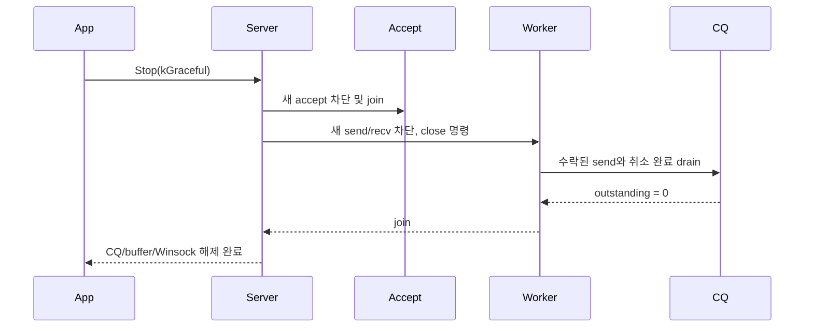

# 정상 종료

```mermaid
sequenceDiagram
  participant App
  participant Server
  participant Accept
  participant Worker
  participant CQ
  App->>Server: Stop(kGraceful)
  Server->>Accept: 새 accept 차단 및 join
  Server->>Worker: 새 send/recv 차단, close 명령
  Worker->>CQ: 수락된 send와 취소 완료 drain
  CQ-->>Worker: outstanding = 0
  Worker-->>Server: join
  Server-->>App: CQ/buffer/Winsock 해제 완료
```

graceful은 timeout까지 수락된 send를 drain하고 immediate는 새 게시를 막고 취소 완료만 drain한다. `Stop`은 동시 호출해도 같은 종료를 기다린다. callback이나 등록 버퍼보다 CQ를 먼저 없애는 순서는 잘못이다.
