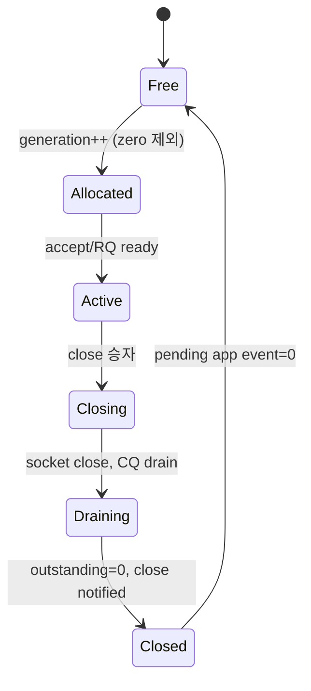

# 세션 수명

```mermaid
stateDiagram-v2
  [*] --> Free
  Free --> Allocated: generation++ (zero 제외)
  Allocated --> Active: accept/RQ ready
  Active --> Closing: close 승자
  Closing --> Draining: socket close, CQ drain
  Draining --> Closed: outstanding=0, close notified
  Closed --> Free: pending app event=0
```

인덱스만 보관해 다음 연결에 송신하는 것은 잘못이다. 모든 send, close, I/O context와 app event에 전체 `SessionId`를 저장하고 현재 generation과 다르면 접근 없이 폐기해야 한다. 동일 수명에서 close 전이와 `OnClosed` 통지는 각각 한 번뿐이다.
